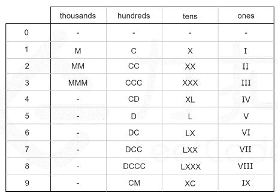

# 题目
罗马数字包含以下七种字符： I， V， X， L，C，D 和 M。

```
字符          数值
I             1
V             5
X             10
L             50
C             100
D             500
M             1000
```
例如， 罗马数字 2 写做 II ，即为两个并列的 1。12 写做 XII ，即为 X + II 。 27 写做  XXVII, 即为 XX + V + II 。

通常情况下，罗马数字中小的数字在大的数字的右边。但也存在特例，例如 4 不写做 IIII，而是 IV。数字 1 在数字 5 的左边，所表示的数等于大数 5 减小数 1 得到的数值 4 。同样地，数字 9 表示为 IX。这个特殊的规则只适用于以下六种情况：

I 可以放在 V (5) 和 X (10) 的左边，来表示 4 和 9。
X 可以放在 L (50) 和 C (100) 的左边，来表示 40 和 90。 
C 可以放在 D (500) 和 M (1000) 的左边，来表示 400 和 900。
给你一个整数，将其转为罗马数字。


# 思路
较为简单，列举所有的，然后从高到低算。

# 题解
使用pair的数组，每个pair可以存储一对数。不使用map因为map是按照key从小到大排序的。可能会造成使用问题。
2. 硬编码
直接确定每一个位上所有出现的可能。
- 千位数字只能由 M 表示；
- 百位数字只能由 C，CD，D 和 CM 表示；
- 十位数字只能由 X，XL，L 和 XC 表示；
- 个位数字只能由 I，IV，V和 IX 表示。  

这恰好把这 131313 个符号分为四组，且组与组之间没有公共的符号。因此，整数 num 的十进制表示中的每一个数字都是可以单独处理的。

进一步地，我们可以计算出每个数字在每个位上的表示形式，整理成一张硬编码表。如下图所示，其中 000 对应的是空字符串。


利用模运算和除法运算，我们可以得到 num\textit{num}num 每个位上的数字：
```
thousands_digit = num / 1000
hundreds_digit = (num % 1000) / 100
tens_digit = (num % 100) / 10
ones_digit = num % 10
```

```c++
const string thousands[] = {"", "M", "MM", "MMM"};
const string hundreds[]  = {"", "C", "CC", "CCC", "CD", "D", "DC", "DCC", "DCCC", "CM"};
const string tens[]      = {"", "X", "XX", "XXX", "XL", "L", "LX", "LXX", "LXXX", "XC"};
const string ones[]      = {"", "I", "II", "III", "IV", "V", "VI", "VII", "VIII", "IX"};

class Solution {
public:
    string intToRoman(int num) {
        return thousands[num / 1000] + hundreds[num % 1000 / 100] + tens[num % 100 / 10] + ones[num % 10];
    }
};
```