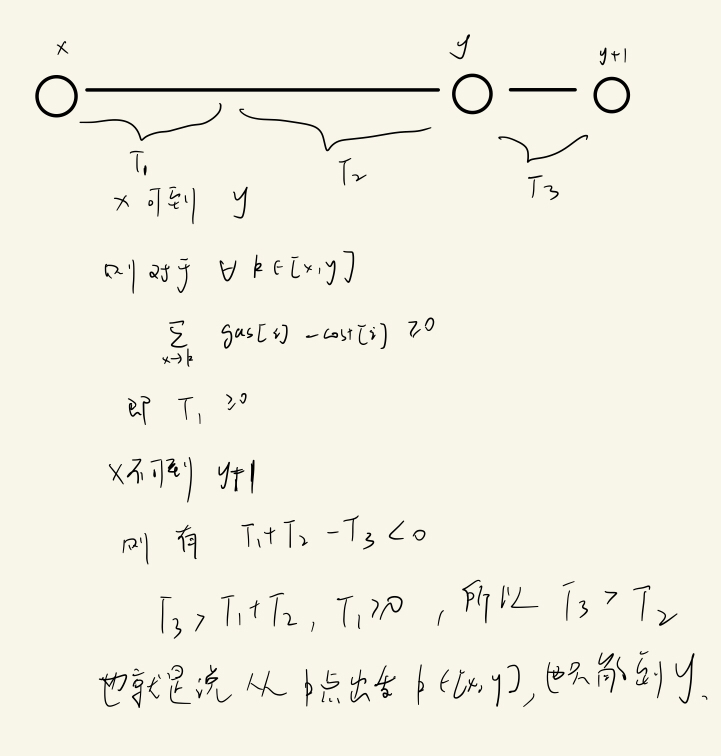

# 题目
在一条环路上有 n 个加油站，其中第 i 个加油站有汽油 gas[i] 升。

你有一辆油箱容量无限的的汽车，从第 i 个加油站开往第 i+1 个加油站需要消耗汽油 cost[i] 升。你从其中的一个加油站出发，开始时油箱为空。

给定两个整数数组 gas 和 cost ，如果你可以按顺序绕环路行驶一周，则返回出发时加油站的编号，否则返回 -1 。如果存在解，则 保证 它是 唯一 的。

# 思路
双重循环超时

# 题解

意思就是x只能到y，那么xy之间的所有点也只能到y。因此下一次就从y开始。