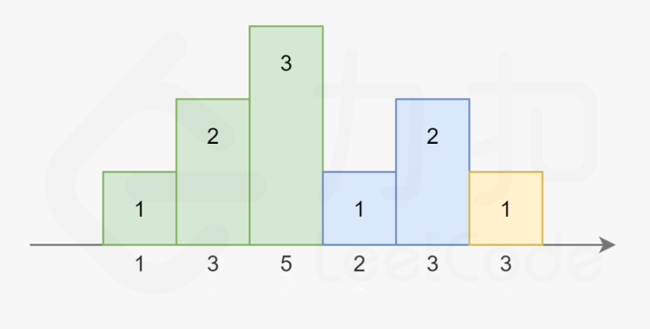
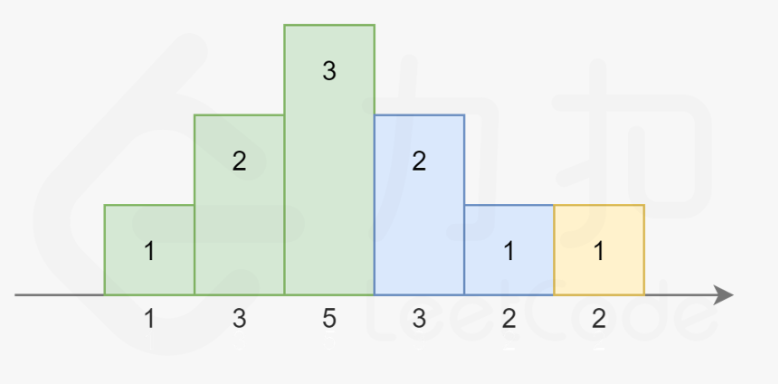

# 题目
n 个孩子站成一排。给你一个整数数组 ratings 表示每个孩子的评分。

你需要按照以下要求，给这些孩子分发糖果：

每个孩子至少分配到 1 个糖果。
相邻两个孩子评分更高的孩子会获得更多的糖果。
请你给每个孩子分发糖果，计算并返回需要准备的 最少糖果数目 。

# 思路
顺序遍历，后一个比前一个大，就相比前一个+1，小，就是1，然后再逆序遍历，进行校验。


# 题解
1. 和我的一致
2. 常数空间遍历  
注意到糖果总是尽量少给，且从 111 开始累计，每次要么比相邻的同学多给一个，要么重新置为 111。依据此规则，我们可以画出下图：

其中相同颜色的柱状图的高度总恰好为 1,2,3…。   
而高度也不一定一定是升序，也可能是 …3,2,1 的降序：

注意到在上图中，对于第三个同学，他既可以被认为是属于绿色的升序部分，也可以被认为是属于蓝色的降序部分。因为他同时比两边的同学评分更高。我们对序列稍作修改：

注意到右边的升序部分变长了，使得第三个同学不得不被分配 4 个糖果。
依据前面总结的规律，我们可以提出本题的解法。我们从左到右枚举每一个同学，记前一个同学分得的糖果数量为 pre：
- 如果当前同学比上一个同学评分高，说明我们就在最近的递增序列中，直接分配给该同学 pre+1 个糖果即可。
- 否则我们就在一个递减序列中，我们直接分配给当前同学一个糖果，并把该同学所在的递减序列中所有的同学都再多分配一个糖果，以保证糖果数量还是满足条件。
    - 我们无需显式地额外分配糖果，只需要记录当前的递减序列长度，即可知道需要额外分配的糖果数量。
    - 同时注意当当前的递减序列长度和上一个递增序列等长时，需要把最近的递增序列的最后一个同学也并进递减序列中。   
    
    这样，我们只要记录当前递减序列的长度 dec，最近的递增序列的长度 inc 和前一个同学分得的糖果数量 pre 即可。
```c++
class Solution {
public:
    int candy(vector<int>& ratings) {
        int n = ratings.size();
        int ret = 1;
        int inc = 1, dec = 0, pre = 1;
        for (int i = 1; i < n; i++) {
            if (ratings[i] >= ratings[i - 1]) {
                dec = 0;
                pre = ratings[i] == ratings[i - 1] ? 1 : pre + 1;
                ret += pre;
                inc = pre;
            } else {
                dec++;
                if (dec == inc) {
                    dec++;
                }
                ret += dec;
                pre = 1;
            }
        }
        return ret;
    }
};

```
递增序列的最后一个并不一定属于递增序列，因此需要额外判断。