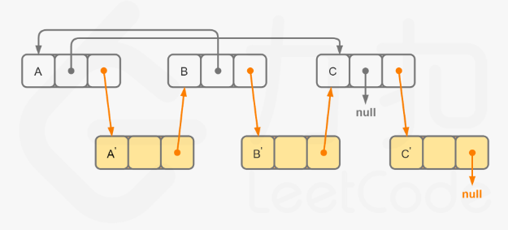

# 题目
给你一个长度为 n 的链表，每个节点包含一个额外增加的随机指针 random ，该指针可以指向链表中的任何节点或空节点。

构造这个链表的 深拷贝。 深拷贝应该正好由 n 个 全新 节点组成，其中每个新节点的值都设为其对应的原节点的值。新节点的 next 指针和 random 指针也都应指向复制链表中的新节点，并使原链表和复制链表中的这些指针能够表示相同的链表状态。复制链表中的指针都不应指向原链表中的节点 。

例如，如果原链表中有 X 和 Y 两个节点，其中 X.random --> Y 。那么在复制链表中对应的两个节点 x 和 y ，同样有 x.random --> y 。

返回复制链表的头节点。

用一个由 n 个节点组成的链表来表示输入/输出中的链表。每个节点用一个 [val, random_index] 表示：

val：一个表示 Node.val 的整数。
random_index：随机指针指向的节点索引（范围从 0 到 n-1）；如果不指向任何节点，则为  null 。
你的代码 只 接受原链表的头节点 head 作为传入参数。

# 思路
使用一个哈希表记录源Node和新Node的映射，这样就可以。

# 题解
1. 和我的思路一样  

但是使用的是递归进行。
```
class Solution {
public:
    unordered_map<Node*, Node*> cachedNode;

    Node* copyRandomList(Node* head) {
        if (head == nullptr) {
            return nullptr;
        }
        if (!cachedNode.count(head)) {
            Node* headNew = new Node(head->val);
            cachedNode[head] = headNew;
            headNew->next = copyRandomList(head->next);
            headNew->random = copyRandomList(head->random);
        }
        return cachedNode[head];
    }
};
```
2. 迭代+节点拆分
不使用map记录的问题在于random找不到。如果硬去找，每次都要遍历，计算下标，在在新的里面根据下标找到对应的。   


上图的方式，  
第一遍建立新的节点，  
第二遍确定random，其根据原链表的random的next即可确定。   
第三遍则是生成最后的结果。

```
class Solution {
public:
    Node* copyRandomList(Node* head) {
        if (head == nullptr) {
            return nullptr;
        }
        for (Node* node = head; node != nullptr; node = node->next->next) {
            Node* nodeNew = new Node(node->val);
            nodeNew->next = node->next;
            node->next = nodeNew;
        }
        for (Node* node = head; node != nullptr; node = node->next->next) {
            Node* nodeNew = node->next;
            nodeNew->random = (node->random != nullptr) ? node->random->next : nullptr;
        }
        Node* headNew = head->next;
        for (Node* node = head; node != nullptr; node = node->next) {
            Node* nodeNew = node->next;
            node->next = node->next->next;
            nodeNew->next = (nodeNew->next != nullptr) ? nodeNew->next->next : nullptr;
        }
        return headNew;
    }
};
```
