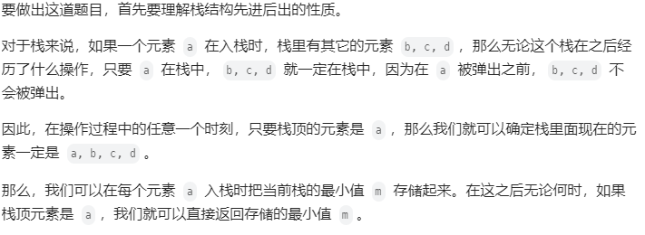
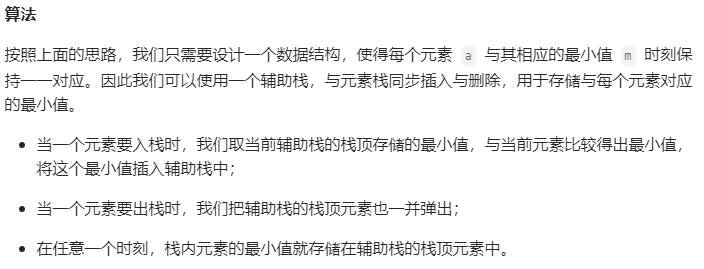

# 题目
设计一个支持 push ，pop ，top 操作，并能在常数时间内检索到最小元素的栈。

实现 MinStack 类:

- MinStack() 初始化堆栈对象。
- void push(int val) 将元素val推入堆栈。
- void pop() 删除堆栈顶部的元素。
- int top() 获取堆栈顶部的元素。
- int getMin() 获取堆栈中的最小元素。

# 思路
一个vector记录，一个map进行排序。
存在问题：内存使用过多。

# 题解


其实就是对于每一个栈顶，其最小值是固定的。都是可以确定的。
```
class MinStack {
    stack<int> x_stack;
    stack<int> min_stack;
public:
    MinStack() {
        min_stack.push(INT_MAX);
    }
    
    void push(int x) {
        x_stack.push(x);
        min_stack.push(min(min_stack.top(), x));
    }
    
    void pop() {
        x_stack.pop();
        min_stack.pop();
    }
    
    int top() {
        return x_stack.top();
    }
    
    int getMin() {
        return min_stack.top();
    }
};
```