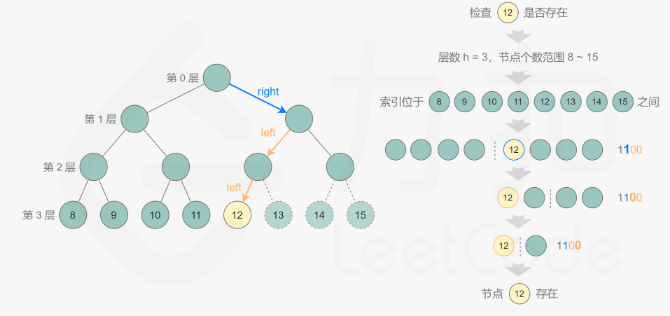

# 题目
给你一棵 完全二叉树 的根节点 root ，求出该树的节点个数。

完全二叉树 的定义如下：在完全二叉树中，除了最底层节点可能没填满外，其余每层节点数都达到最大值，并且最下面一层的节点都集中在该层最左边的若干位置。若最底层为第 h 层，则该层包含 $1 --- 2^h$ 个节点。

# 思路
递归

# 题解

先确定层数，如图中的4层，则为4位二进制。1的二进制表示为1100。其实就代表了从根节点如何到达12号节点的方法。即取后三位： 右子树，左子树，左子树。    

现在知道如何根据节点编号到达对应的节点了。

一个完全二叉树，只有最底层不满，即节点个数节点个数一定在 $[2^h,2^{h+1}-1]$ 的范围内，，也就是说只需要判断范围内的节点是否存在即可。使用二分搜索进行判断。

```
class Solution {
public:
    int countNodes(TreeNode* root) {
        if (root == nullptr) {
            return 0;
        }
        int level = 0;
        TreeNode* node = root;
        while (node->left != nullptr) {
            level++;
            node = node->left;
        }
        int low = 1 << level, high = (1 << (level + 1)) - 1;
        while (low < high) {
            int mid = (high - low + 1) / 2 + low;
            if (exists(root, level, mid)) {
                low = mid;
            } else {
                high = mid - 1;
            }
        }
        return low;
    }

    bool exists(TreeNode* root, int level, int k) {
        int bits = 1 << (level - 1);
        TreeNode* node = root;
        while (node != nullptr && bits > 0) {
            if (!(bits & k)) {
                node = node->left;
            } else {
                node = node->right;
            }
            bits >>= 1;
        }
        return node != nullptr;
    }
};
```