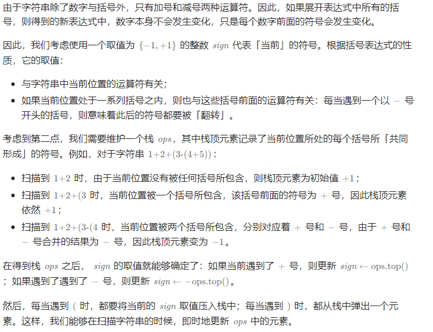

# 题目
给你一个字符串表达式 s ，请你实现一个基本计算器来计算并返回它的值。

注意:不允许使用任何将字符串作为数学表达式计算的内置函数，比如 eval() 。


# 思路
注意到运算符只有 +，-。对于 + 来说，括号并没有作用。因此忽略。而 － 则需要考虑括号。因为其影响当前数字的正负。   
以此为思路，遍历，遇到 - 压入,同时改变记录的正负号，遇到 ( , ) 压入。   
而遇到的数字则根据当前的正负进行相加。   
意思就是对于一个数来说，其正负号是由前面的符号和括号确定的。因此需要记录。


# 题解

```
class Solution {
public:
    int calculate(string s) {
        stack<int> ops;
        ops.push(1);
        int sign = 1;

        int ret = 0;
        int n = s.length();
        int i = 0;
        while (i < n) {
            if (s[i] == ' ') {
                i++;
            } else if (s[i] == '+') {
                sign = ops.top();
                i++;
            } else if (s[i] == '-') {
                sign = -ops.top();
                i++;
            } else if (s[i] == '(') {
                ops.push(sign);
                i++;
            } else if (s[i] == ')') {
                ops.pop();
                i++;
            } else {
                long num = 0;
                while (i < n && s[i] >= '0' && s[i] <= '9') {
                    num = num * 10 + s[i] - '0';
                    i++;
                }
                ret += sign * num;
            }
        }
        return ret;
    }
};
```