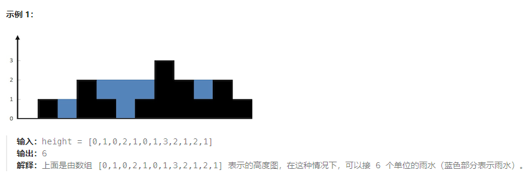
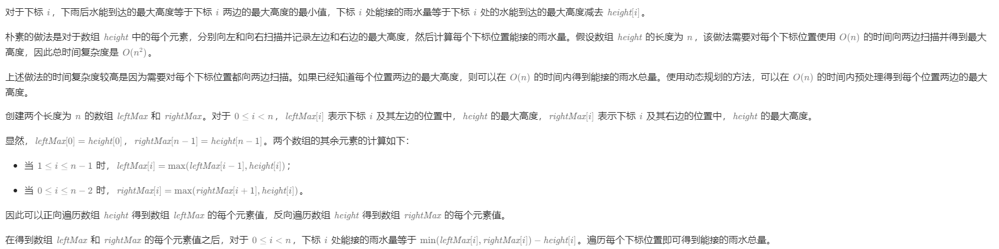

# 题目
给定 n 个非负整数表示每个宽度为 1 的柱子的高度图，计算按此排列的柱子，下雨之后能接多少雨水。
- n == height.length
- 1 <= n <= 2 * 104
- 0 <= height[i] <= 105      



# 思路
想要使用双指针，但是失败。思路有问题。

突然看到一个计算每个位置下左右两边的最大高度。以此想到正序遍历和倒序遍历，这样生成两个最大高度数组，就可以得到结果。

# 题解
1. 思路就是上面的说的,但是又有些出入
     


2. 栈
3. 双指针   
参照方法1，想要利用左右的最大值，但是对于左边的来说，他不知道右边的最大值，但是知道左边的最大值。对于右边的来说，其不知道左边的最大值，但是知道右边的最大值。而一个位置的水深是由左右两侧最大值的最小值决定的。因此可以以此出现判断条件：  
`height[left] < height[right]`，则必有 `leftMax < rightMax`，  
下标 left 处能接的雨水量等于 `leftMax − height[left]`，将下标 left 处能接的雨水量加到能接的雨水总量，然后将 left 加 1（即向右移动一位）；   
```c++
class Solution {
public:
    int trap(vector<int>& height) {
        int ans = 0;
        int left = 0, right = height.size() - 1;
        int leftMax = 0, rightMax = 0;
        while (left < right) {
            leftMax = max(leftMax, height[left]);
            rightMax = max(rightMax, height[right]);
            if (height[left] < height[right]) {
                ans += leftMax - height[left];
                ++left;
            } else {
                ans += rightMax - height[right];
                --right;
            }
        }
        return ans;
    }
};
```