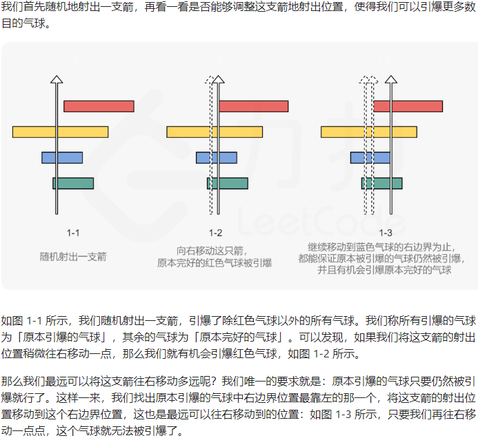
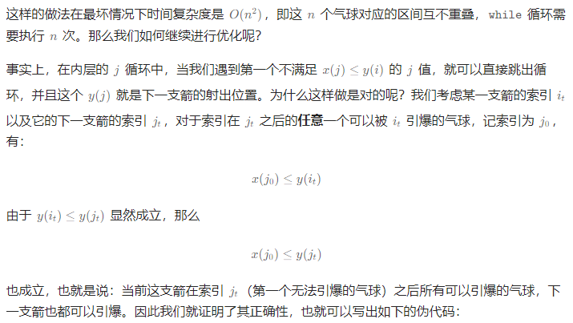

# 题目
有一些球形气球贴在一堵用 XY 平面表示的墙面上。墙面上的气球记录在整数数组 points ，其中points[i] = [$x_{start}$，$x_{end}$] 表示水平直径在 $x_{start}$ 和 $x_{end}$ 之间的气球。你不知道气球的确切 y 坐标。

一支弓箭可以沿着 x 轴从不同点 完全垂直 地射出。在坐标 x 处射出一支箭，若有一个气球的直径的开始和结束坐标为 $x_start$，$x_end$， 且满足  $x_{start} ≤ x ≤ x_{end}$，则该气球会被 引爆 。可以射出的弓箭的数量 没有限制 。 弓箭一旦被射出之后，可以无限地前进。

给你一个数组 points ，返回引爆所有气球所必须射出的 最小 弓箭数 。


- 1 <= points.length <= 105
- points[i].length == 2
- -231 <= xstart < xend <= 231 - 1

# 思路
考虑合并？但是正确性未知

# 题解


伪代码
```
let points := [[x(0), y(0)], [x(1), y(1)], ... [x(n-1), y(n-1)]]，表示 n 个气球
let burst := [false] * n，表示每个气球是否被引爆
let ans := 1，表示射出的箭数

将 points 按照 y 值（右边界）进行升序排序

while burst 中还有 false 值 do
    let i := 最小的满足 burst[i] = false 的索引 i
    for j := i to n-1 do
        if x(j) <= y(i) then
            burst[j] := true
        end if
    end for
end while

return ans
```

```
let points := [[x(0), y(0)], [x(1), y(1)], ... [x(n-1), y(n-1)]]，表示 n 个气球
let pos := y(0)，表示当前箭的射出位置
let ans := 1，表示射出的箭数

将 points 按照 y 值（右边界）进行升序排序

for i := 1 to n-1 do
    if x(i) > pos then
        ans := ans + 1
        pos := y(i)
    end if
end for

return ans
```