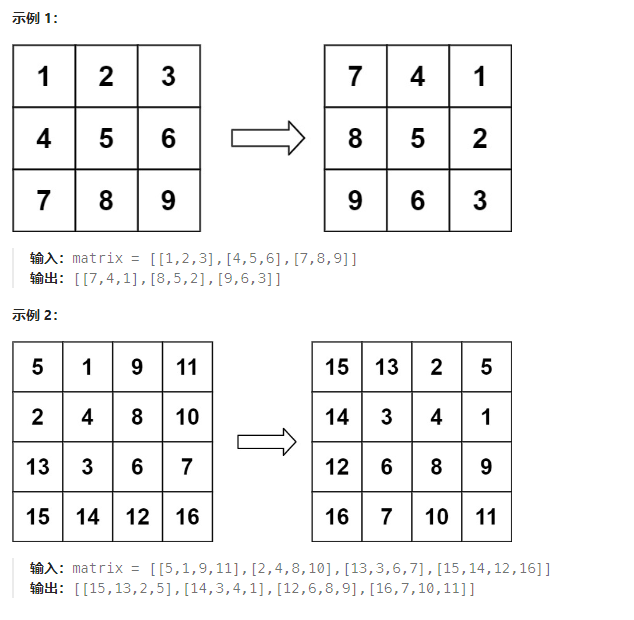
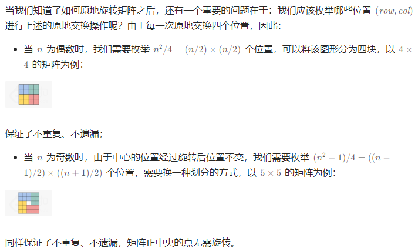

# 题目
给定一个 n × n 的二维矩阵 matrix 表示一个图像。请你将图像顺时针旋转 90 度。

你必须在 原地 旋转图像，这意味着你需要直接修改输入的二维矩阵。请不要 使用另一个矩阵来旋转图像。  




# 思路
能够算出来一个映射，且每个循环四次。   
但是就卡在了哪些点是需要进行循环的。   
像他的示例2，我想的是5,1,9,4这四个，这是对的，但是n一变就找不到了，但是实际上9不就是下边的2.
因此转成5,1,2,4。一下子就好算了。


# 题解   


```c++
class Solution {
public:
    void rotate(vector<vector<int>>& matrix) {
        int n = matrix.size();
        for (int i = 0; i < n / 2; ++i) {
            for (int j = 0; j < (n + 1) / 2; ++j) {
                int temp = matrix[i][j];
                matrix[i][j] = matrix[n - j - 1][i];
                matrix[n - j - 1][i] = matrix[n - i - 1][n - j - 1];
                matrix[n - i - 1][n - j - 1] = matrix[j][n - i - 1];
                matrix[j][n - i - 1] = temp;
            }
        }
    }
};
```