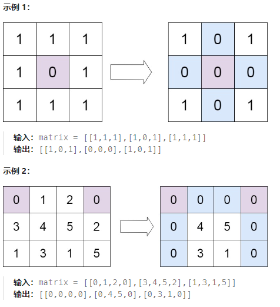

# 题目
给定一个 m x n 的矩阵，如果一个元素为 0 ，则将其所在行和列的所有元素都设为 0 。请使用 原地 算法。    

- m == matrix.length
- n == matrix[0].length
- 1 <= m, n <= 200
- -231 <= matrix[i][j] <= 231 - 1

# 思路
记录行和列需要清零的。  
存在问题：  
后面置零的时候过于麻烦的，只需要遍历，只要行或者列有记录，就清零。
```
class Solution {
public:
    void setZeroes(vector<vector<int>>& matrix) {
        int m = matrix.size();
        int n = matrix[0].size();
        vector<int> row(m), col(n);
        for (int i = 0; i < m; i++) {
            for (int j = 0; j < n; j++) {
                if (!matrix[i][j]) {
                    row[i] = col[j] = true;
                }
            }
        }
        for (int i = 0; i < m; i++) {
            for (int j = 0; j < n; j++) {
                if (row[i] || col[j]) {
                    matrix[i][j] = 0;
                }
            }
        }
    }
};
```


# 题解
1. 使用两个数组记录
2. 使用矩阵的第一行和第一列代替两个数组记录。   
但是这样就不能确定第一行和第一列是否会清零（原本的信息被覆盖）因此需要两个变量去记录原始的第一行和第一列是否需要清零。  
之后进行遍历，只需要经需要置零的行和列的对应第一行和第一列的位置改成0就可以了。   
最后在判断两个变量决定是否要清零第一行和第一列。   
注意看，这里是吧第一列和第一行分离出来了，最后在单独处理。
```
class Solution {
public:
    void setZeroes(vector<vector<int>>& matrix) {
        int m = matrix.size();
        int n = matrix[0].size();
        int flag_col0 = false, flag_row0 = false;
        for (int i = 0; i < m; i++) {
            if (!matrix[i][0]) {
                flag_col0 = true;
            }
        }
        for (int j = 0; j < n; j++) {
            if (!matrix[0][j]) {
                flag_row0 = true;
            }
        }
        for (int i = 1; i < m; i++) {
            for (int j = 1; j < n; j++) {
                if (!matrix[i][j]) {
                    matrix[i][0] = matrix[0][j] = 0;
                }
            }
        }
        for (int i = 1; i < m; i++) {
            for (int j = 1; j < n; j++) {
                if (!matrix[i][0] || !matrix[0][j]) {
                    matrix[i][j] = 0;
                }
            }
        }
        if (flag_col0) {
            for (int i = 0; i < m; i++) {
                matrix[i][0] = 0;
            }
        }
        if (flag_row0) {
            for (int j = 0; j < n; j++) {
                matrix[0][j] = 0;
            }
        }
    }
};
```
3. 我们可以对方法二进一步优化，只使用一个标记变量记录第一列是否原本存在 0。这样，第一列的第一个元素即可以标记第一行是否出现 0。但为了防止每一列的第一个元素被提前更新，我们需要从最后一行开始，倒序地处理矩阵元素。
```
class Solution {
public:
    void setZeroes(vector<vector<int>>& matrix) {
        int m = matrix.size();
        int n = matrix[0].size();
        int flag_col0 = false;
        for (int i = 0; i < m; i++) {
            if (!matrix[i][0]) {
                flag_col0 = true;
            }
            for (int j = 1; j < n; j++) {
                if (!matrix[i][j]) {
                    matrix[i][0] = matrix[0][j] = 0;
                }
            }
        }
        for (int i = m - 1; i >= 0; i--) {
            for (int j = 1; j < n; j++) {
                if (!matrix[i][0] || !matrix[0][j]) {
                    matrix[i][j] = 0;
                }
            }
            if (flag_col0) {
                matrix[i][0] = 0;
            }
        }
    }
};
```
这里用第一列的每一个数代表所在行是否存在0，由于第一行的每一个数还记录着其所在列是否存在0，因此需要从行数倒序开始，方式把第一行清空。