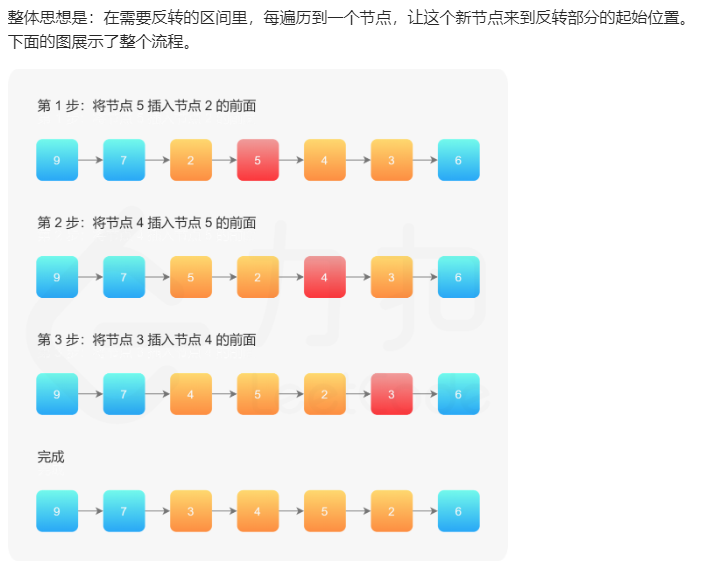
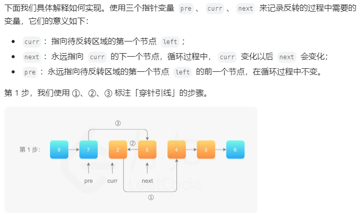
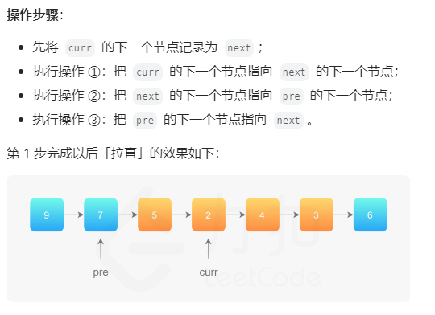
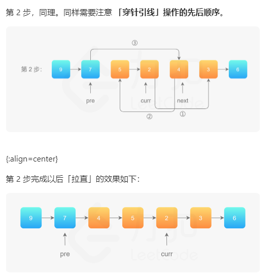

# 题目
给你单链表的头指针 head 和两个整数 left 和 right ，其中 left <= right 。请你反转从位置 left 到位置 right 的链表节点，返回 反转后的链表 。


- 链表中节点数目为 n
- 1 <= n <= 500
- -500 <= Node.val <= 500
- 1 <= left <= right <= n

# 思路
记录left的前一个和right的后一个。然后cur，next，origin中，让next的下一个改为cur。


# 题解
1. 穿针引线
其新建了一个空的头，来避免left是头的情况。
```
class Solution {
private:
    void reverseLinkedList(ListNode *head) {
        // 也可以使用递归反转一个链表
        ListNode *pre = nullptr;
        ListNode *cur = head;

        while (cur != nullptr) {
            ListNode *next = cur->next;
            cur->next = pre;
            pre = cur;
            cur = next;
        }
    }

public:
    ListNode *reverseBetween(ListNode *head, int left, int right) {
        // 因为头节点有可能发生变化，使用虚拟头节点可以避免复杂的分类讨论
        ListNode *dummyNode = new ListNode(-1);
        dummyNode->next = head;

        ListNode *pre = dummyNode;
        // 第 1 步：从虚拟头节点走 left - 1 步，来到 left 节点的前一个节点
        // 建议写在 for 循环里，语义清晰
        for (int i = 0; i < left - 1; i++) {
            pre = pre->next;
        }

        // 第 2 步：从 pre 再走 right - left + 1 步，来到 right 节点
        ListNode *rightNode = pre;
        for (int i = 0; i < right - left + 1; i++) {
            rightNode = rightNode->next;
        }

        // 第 3 步：切断出一个子链表（截取链表）
        ListNode *leftNode = pre->next;
        ListNode *curr = rightNode->next;

        // 注意：切断链接
        pre->next = nullptr;
        rightNode->next = nullptr;

        // 第 4 步：同第 206 题，反转链表的子区间
        reverseLinkedList(leftNode);

        // 第 5 步：接回到原来的链表中
        pre->next = rightNode;
        leftNode->next = curr;
        return dummyNode->next;
    }
};
```
2. 一次遍历「穿针引线」反转链表（头插法）   

和我的思路一致,但是有所不同 





```
class Solution {
public:
    ListNode *reverseBetween(ListNode *head, int left, int right) {
        // 设置 dummyNode 是这一类问题的一般做法
        ListNode *dummyNode = new ListNode(-1);
        dummyNode->next = head;
        ListNode *pre = dummyNode;
        for (int i = 0; i < left - 1; i++) {
            pre = pre->next;
        }
        ListNode *cur = pre->next;
        ListNode *next;
        for (int i = 0; i < right - left; i++) {
            next = cur->next;
            cur->next = next->next;
            next->next = pre->next;
            pre->next = next;
        }
        return dummyNode->next;
    }
};
```